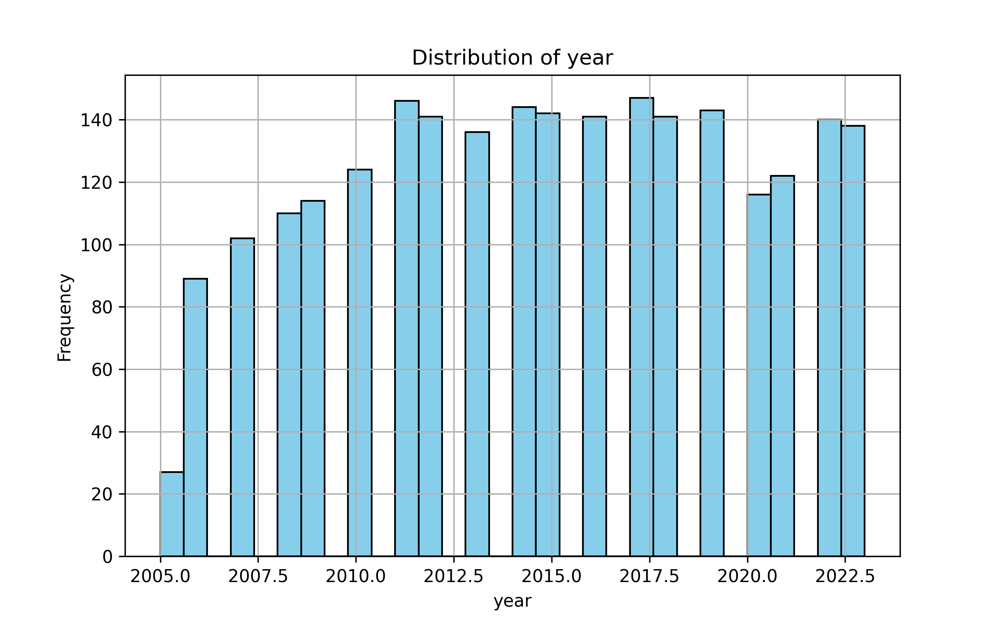
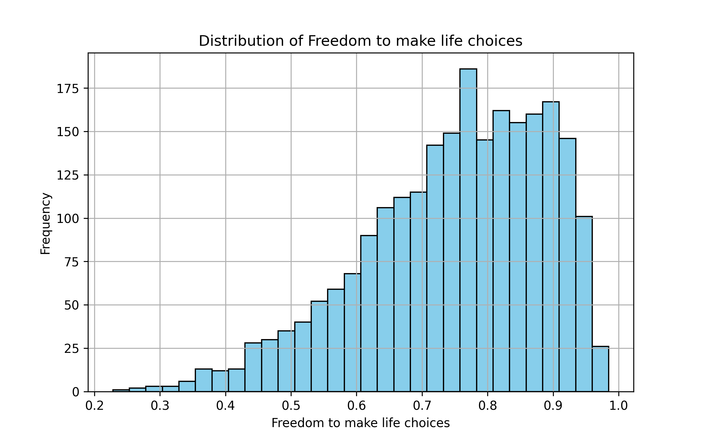
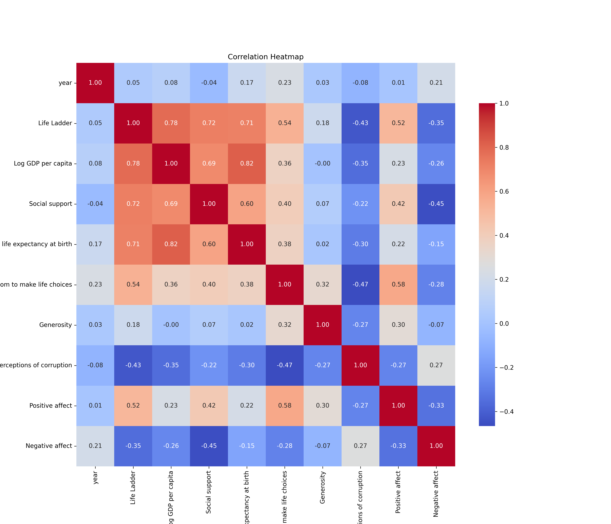

# Analysis Report

## Dataset Analysis
Structure: {'Country name': {0: 'Afghanistan', 1: 'Afghanistan', 2: 'Afghanistan', 3: 'Afghanistan', 4: 'Afghanistan'}, 'year': {0: 2008, 1: 2009, 2: 2010, 3: 2011, 4: 2012}, 'Life Ladder': {0: 3.724, 1: 4.402, 2: 4.758, 3: 3.832, 4: 3.783}, 'Log GDP per capita': {0: 7.35, 1: 7.509, 2: 7.614, 3: 7.581, 4: 7.661}, 'Social support': {0: 0.451, 1: 0.552, 2: 0.539, 3: 0.521, 4: 0.521}, 'Healthy life expectancy at birth': {0: 50.5, 1: 50.8, 2: 51.1, 3: 51.4, 4: 51.7}, 'Freedom to make life choices': {0: 0.718, 1: 0.679, 2: 0.6, 3: 0.496, 4: 0.531}, 'Generosity': {0: 0.164, 1: 0.187, 2: 0.118, 3: 0.16, 4: 0.234}, 'Perceptions of corruption': {0: 0.882, 1: 0.85, 2: 0.707, 3: 0.731, 4: 0.776}, 'Positive affect': {0: 0.414, 1: 0.481, 2: 0.517, 3: 0.48, 4: 0.614}, 'Negative affect': {0: 0.258, 1: 0.237, 2: 0.275, 3: 0.267, 4: 0.268}, 0: {0: 2008.0, 1: 2009.0, 2: 2010.0, 3: 2011.0, 4: 2012.0}, 1: {0: 3.724, 1: 4.402, 2: 4.758, 3: 3.832, 4: 3.783}, 2: {0: 7.35, 1: 7.509, 2: 7.614, 3: 7.581, 4: 7.661}, 3: {0: 0.451, 1: 0.552, 2: 0.539, 3: 0.521, 4: 0.521}, 4: {0: 50.5, 1: 50.8, 2: 51.1, 3: 51.4, 4: 51.7}, 5: {0: 0.718, 1: 0.679, 2: 0.6, 3: 0.496, 4: 0.531}, 6: {0: 0.164, 1: 0.187, 2: 0.118, 3: 0.16, 4: 0.234}, 7: {0: 0.882, 1: 0.85, 2: 0.707, 3: 0.731, 4: 0.776}, 8: {0: 0.414, 1: 0.481, 2: 0.517, 3: 0.48, 4: 0.614}, 9: {0: 0.258, 1: 0.237, 2: 0.275, 3: 0.267, 4: 0.268}}
Shape: (2363, 21)
Columns:
{'Country name': dtype('O'), 'year': dtype('int64'), 'Life Ladder': dtype('float64'), 'Log GDP per capita': dtype('float64'), 'Social support': dtype('float64'), 'Healthy life expectancy at birth': dtype('float64'), 'Freedom to make life choices': dtype('float64'), 'Generosity': dtype('float64'), 'Perceptions of corruption': dtype('float64'), 'Positive affect': dtype('float64'), 'Negative affect': dtype('float64'), 0: dtype('float64'), 1: dtype('float64'), 2: dtype('float64'), 3: dtype('float64'), 4: dtype('float64'), 5: dtype('float64'), 6: dtype('float64'), 7: dtype('float64'), 8: dtype('float64'), 9: dtype('float64')}
Missing Values:
{'Country name': 0, 'year': 0, 'Life Ladder': 0, 'Log GDP per capita': 28, 'Social support': 13, 'Healthy life expectancy at birth': 63, 'Freedom to make life choices': 36, 'Generosity': 81, 'Perceptions of corruption': 125, 'Positive affect': 24, 'Negative affect': 16, 0: 0, 1: 0, 2: 0, 3: 0, 4: 0, 5: 0, 6: 0, 7: 0, 8: 0, 9: 0}
Summary Statistics:
{'Country name': {'count': 2363, 'unique': 165, 'top': 'Lebanon', 'freq': 18, 'mean': nan, 'std': nan, 'min': nan, '25%': nan, '50%': nan, '75%': nan, 'max': nan}, 'year': {'count': 2363.0, 'unique': nan, 'top': nan, 'freq': nan, 'mean': 2014.7638595006347, 'std': 5.059436468192803, 'min': 2005.0, '25%': 2011.0, '50%': 2015.0, '75%': 2019.0, 'max': 2023.0}, 'Life Ladder': {'count': 2363.0, 'unique': nan, 'top': nan, 'freq': nan, 'mean': 5.483565806178587, 'std': 1.1255215132391931, 'min': 1.281, '25%': 4.647, '50%': 5.449, '75%': 6.3235, 'max': 8.019}, 'Log GDP per capita': {'count': 2335.0, 'unique': nan, 'top': nan, 'freq': nan, 'mean': 9.399671092077089, 'std': 1.1520694444710216, 'min': 5.527, '25%': 8.506499999999999, '50%': 9.503, '75%': 10.3925, 'max': 11.676}, 'Social support': {'count': 2350.0, 'unique': nan, 'top': nan, 'freq': nan, 'mean': 0.8093693617021277, 'std': 0.1212117642029914, 'min': 0.228, '25%': 0.744, '50%': 0.8345, '75%': 0.904, 'max': 0.987}, 'Healthy life expectancy at birth': {'count': 2300.0, 'unique': nan, 'top': nan, 'freq': nan, 'mean': 63.40182826086957, 'std': 6.842644351828012, 'min': 6.72, '25%': 59.195, '50%': 65.1, '75%': 68.5525, 'max': 74.6}, 'Freedom to make life choices': {'count': 2327.0, 'unique': nan, 'top': nan, 'freq': nan, 'mean': 0.750281908036098, 'std': 0.13935703459253493, 'min': 0.228, '25%': 0.661, '50%': 0.771, '75%': 0.862, 'max': 0.985}, 'Generosity': {'count': 2282.0, 'unique': nan, 'top': nan, 'freq': nan, 'mean': 9.772129710780206e-05, 'std': 0.16138760312630684, 'min': -0.34, '25%': -0.112, '50%': -0.022, '75%': 0.09375, 'max': 0.7}, 'Perceptions of corruption': {'count': 2238.0, 'unique': nan, 'top': nan, 'freq': nan, 'mean': 0.7439709562109026, 'std': 0.1848654805936832, 'min': 0.035, '25%': 0.687, '50%': 0.7985, '75%': 0.86775, 'max': 0.983}, 'Positive affect': {'count': 2339.0, 'unique': nan, 'top': nan, 'freq': nan, 'mean': 0.6518820008550662, 'std': 0.10623970474397638, 'min': 0.179, '25%': 0.572, '50%': 0.663, '75%': 0.737, 'max': 0.884}, 'Negative affect': {'count': 2347.0, 'unique': nan, 'top': nan, 'freq': nan, 'mean': 0.27315083084789094, 'std': 0.0871310724579503, 'min': 0.083, '25%': 0.209, '50%': 0.262, '75%': 0.326, 'max': 0.705}, 0: {'count': 2363.0, 'unique': nan, 'top': nan, 'freq': nan, 'mean': 2014.7638595006347, 'std': 5.059436468192803, 'min': 2005.0, '25%': 2011.0, '50%': 2015.0, '75%': 2019.0, 'max': 2023.0}, 1: {'count': 2363.0, 'unique': nan, 'top': nan, 'freq': nan, 'mean': 5.483565806178587, 'std': 1.1255215132391931, 'min': 1.281, '25%': 4.647, '50%': 5.449, '75%': 6.3235, 'max': 8.019}, 2: {'count': 2363.0, 'unique': nan, 'top': nan, 'freq': nan, 'mean': 9.399671092077089, 'std': 1.1452205633024595, 'min': 5.527, '25%': 8.52, '50%': 9.492, '75%': 10.382, 'max': 11.676}, 3: {'count': 2363.0, 'unique': nan, 'top': nan, 'freq': nan, 'mean': 0.8093693617021276, 'std': 0.12087774068835622, 'min': 0.228, '25%': 0.744, '50%': 0.834, '75%': 0.904, 'max': 0.987}, 4: {'count': 2363.0, 'unique': nan, 'top': nan, 'freq': nan, 'mean': 63.40182826086957, 'std': 6.750773035270505, 'min': 6.72, '25%': 59.545, '50%': 64.9, '75%': 68.4, 'max': 74.6}, 5: {'count': 2363.0, 'unique': nan, 'top': nan, 'freq': nan, 'mean': 0.750281908036098, 'std': 0.1382909642726584, 'min': 0.228, '25%': 0.662, '50%': 0.769, '75%': 0.861, 'max': 0.985}, 6: {'count': 2363.0, 'unique': nan, 'top': nan, 'freq': nan, 'mean': 9.772129710780079e-05, 'std': 0.15859623298729603, 'min': -0.34, '25%': -0.108, '50%': -0.015, '75%': 0.088, 'max': 0.7}, 7: {'count': 2363.0, 'unique': nan, 'top': nan, 'freq': nan, 'mean': 0.7439709562109027, 'std': 0.17990733468575265, 'min': 0.035, '25%': 0.696, '50%': 0.79, '75%': 0.864, 'max': 0.983}, 8: {'count': 2363.0, 'unique': nan, 'top': nan, 'freq': nan, 'mean': 0.6518820008550663, 'std': 0.10569858218603116, 'min': 0.179, '25%': 0.573, '50%': 0.662, '75%': 0.7364999999999999, 'max': 0.884}, 9: {'count': 2363.0, 'unique': nan, 'top': nan, 'freq': nan, 'mean': 0.27315083084789094, 'std': 0.08683546152117355, 'min': 0.083, '25%': 0.209, '50%': 0.263, '75%': 0.326, 'max': 0.705}}

## LLM Insights
### Data Summary

The dataset 'happiness.csv' contains 2363 rows and 21 columns, capturing various indicators of happiness across different countries and years. Key columns include:

- **Country name**: The name of the country.
- **Year**: The year of the observation.
- **Life Ladder**: A subjective measure of well-being.
- **Log GDP per capita**: The logarithm of GDP per capita, indicating economic prosperity.
- **Social support**: A measure of perceived social support.
- **Healthy life expectancy at birth**: An indicator of health.
- **Freedom to make life choices**: A measure of personal freedom.
- **Generosity**: A measure of charitable giving.
- **Perceptions of corruption**: A measure of perceived corruption in governance.
- **Positive affect**: The presence of positive emotions.
- **Negative affect**: The presence of negative emotions.

### Key Insights

1. **Correlations**:
   - **Strong Positive Correlations**: 
     - **Life Ladder** has a strong positive correlation with **Log GDP per capita** (0.78), **Social support** (0.72), and **Healthy life expectancy at birth** (0.71). This suggests that higher

## Charts

